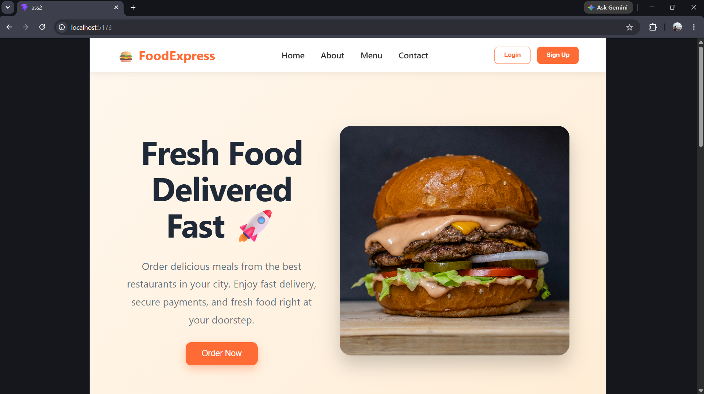
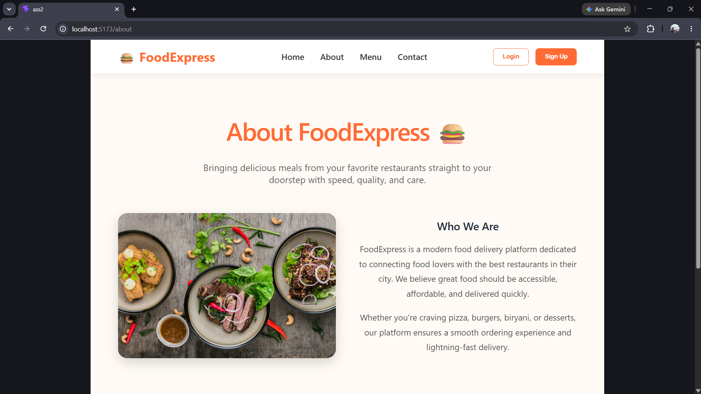
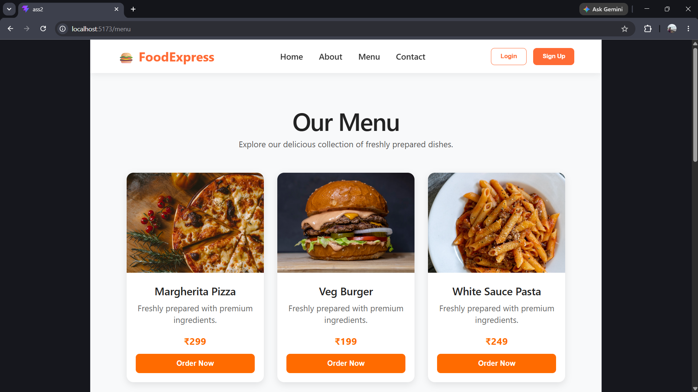
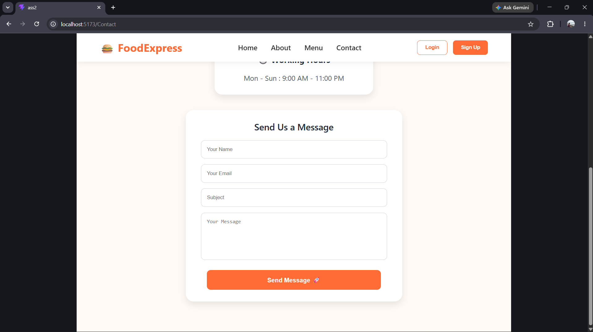

# 🍔 FoodExpress - Food Delivery Website

## 📌 Project Overview

FoodExpress is a modern food delivery website developed using React JS. The website provides users with an easy and interactive way to explore food items, learn about the company, view the menu, and contact the team. The project focuses on creating a clean, responsive, and user-friendly interface inspired by popular food delivery platforms.

---

## 🚀 Features

* Modern Responsive Navigation Bar
* Professional Home Page
* About Us Page
* Interactive Menu Page
* Contact Us Page with Contact Form
* Attractive UI Design
* Mobile-Friendly Layout
* Add Details (Order) Page
Admin Dashboard

---

## 🛠️ Technologies Used

* React JS
* JSX
* CSS
* Vite
* JavaScript

---

## 🏠 Home Page

The Home Page serves as the landing page of FoodExpress. It features a modern hero section with food imagery, featured dishes, popular categories, and information about the services provided.

### Screenshot



---

## ℹ️ About Us Page

The About Us page introduces FoodExpress and explains its mission, vision, and commitment to delivering fresh and delicious food to customers.

### Screenshot



---

## 🍕 Menu Page

The Menu Page displays various food categories and featured dishes available for customers to explore.

### Screenshot



---

## 📞 Contact Us Page

The Contact Page allows users to get in touch through a contact form and provides important contact information.

### Screenshot



---

👨‍💼 Admin Dashboard

The Admin Dashboard is designed for administrators to manage customer order information.

Features
View all customer records
Display customer Name, Phone Number, and Address
Retrieve data directly from Supabase
Delete customer records
Manage submitted order information efficiently

This dashboard helps administrators monitor and manage all customer order requests in one place.

---

# Admin page


## 📥 Installation

Clone the repository:

```bash
https://github.com/yashnanavare6/Food-Express-Website
```

Navigate to the project folder:

```bash
cd ass2
```

Install dependencies:

```bash
npm install
```

Run the project:

```bash
npm run dev
```

---

## 🎯 Future Enhancements

* User Authentication
* Shopping Cart Functionality
* Online Payment Integration
* Order Tracking System
* Restaurant Reviews & Ratings

---

## 👨‍💻 Author

Developed by Yash Nanavare.
